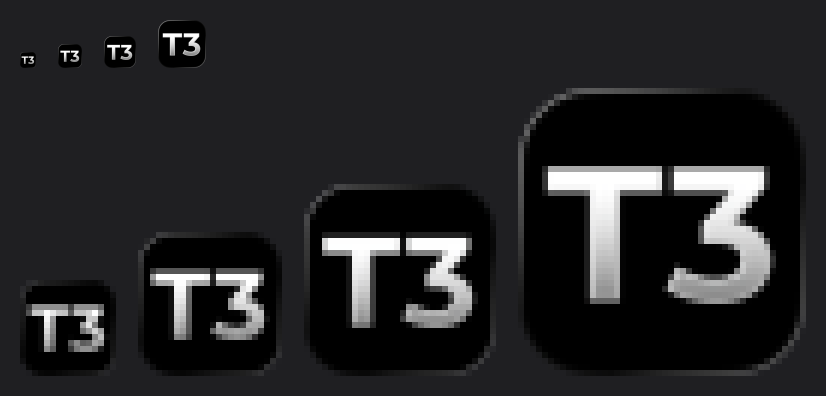
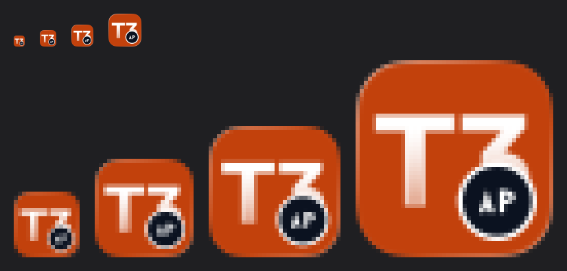

# Fork Windows Build

> For maintainers of this fork. Using T3 Code? See [docs/user](../user/).

This fork never goes upstream ([#34](https://github.com/autoprintworks/t3code/issues/34)), so a fix
landed here only reaches the captain's desktop by building this repo's own installer and running it.
`.github/workflows/release.yml` cannot do that build: it needs runner infrastructure and Azure/Apple
signing secrets this fork does not have. The build described here is local, unsigned, NSIS-only.

## The command

```sh
vp run dist:desktop:win
```

That single command builds server, web, and desktop (`vp run build:desktop`), compiles the
resource-monitor helper, stages icons, and packages an unsigned NSIS installer to
`./release/T3-Code-<version>-x64.exe`. Nothing here is CI-only or secret-gated.

Prerequisites, beyond the usual [first checkout](../internals/scripts.md#first-checkout) (`vp i`):

- Rust, with the `x86_64-pc-windows-msvc` target, on `PATH` (`rustup target add
x86_64-pc-windows-msvc`). The resource-monitor helper is built with `cargo build --release`.
- MSVC build tools able to link that target (Visual Studio Build Tools, "Desktop development with
  C++" workload, or the standalone C++ build tools). Rust's `x86_64-pc-windows-msvc` target needs
  `link.exe`; without it the resource-monitor build fails before packaging starts.

Both are checked once, at the start of the run — cargo errors out immediately if either is missing,
before any packaging work happens.

Optional: `--arch arm64` for an arm64 installer (defaults to `x64`). `T3CODE_DESKTOP_WSL_PREBUILD` /
`--wsl-prebuild <path>` bundles a prebuilt Linux `pty.node` for the WSL backend; omitting it is a
warning, not a build failure — the packaged app just won't have a working WSL backend.

## T3 Connect values

Upstream ships T3 Connect switched off in a fresh clone. It turns on only when the public
identifiers in `.env.example` reach the build through a repository-root `.env` or `.env.local`,
which `scripts/lib/public-config.ts` loads. So `dist:desktop:win` copies `.env.example` to `.env`
when the clone has neither file ([`scripts/lib/fork-public-env.ts`](../../scripts/lib/fork-public-env.ts),
called from `scripts/build-desktop-artifact.ts`). An existing `.env` or `.env.local` is never
overwritten, the fork keeps no second copy of the values, and an upstream edit to `.env.example`
flows straight into the next build. `.github/workflows/fork-update.yml` gets it from the same call,
because its build step runs the same script. The four values are public identifiers, as
`.env.example` says; no secret goes near this. Upstream injects the relay URL into the server
bundle and the web client but not into the desktop main bundle, so `server.asar` carries both
values and `app.asar` carries the Clerk key alone. See [connect-setup.md](connect-setup.md).

A local `dist:desktop:win` leaves that `.env` in the repository root, and the next build keeps it,
so a later upstream change to `.env.example` reaches this machine only once you delete `.env`. A
hand-written `.env` or `.env.local` is yours in full: when it is missing one of the four values, T3
Connect stays off, because nothing fills a single missing key from `.env.example`.

Known risk: the fork's OAuth callback scheme is `t3code-fork://` and the official Clerk instance
allowlists `t3code://app/` and `t3code-dev://app/` only, so a Google or GitHub sign-in may open the
browser and never come back, while email code sign-in stays in the window
([#137](https://github.com/autoprintworks/t3code/issues/137)).

## The collision decision — read before running the installer

**This build installs beside the official release, not over it.** The original decision in
[#34](https://github.com/autoprintworks/t3code/issues/34) was to overwrite in place, on the theory that
there was only ever one T3 Code install and one database on this machine anyway. That held only until
this fork actually got its own installer built and run for the first time — at that point "we don't know
if anything will break yet" (an unproven local build touching the one real database) outweighed the
convenience of a shared thread list on day one. So the fork now gets its own identity end to end:

- **Different install location.** `scripts/build-desktop-artifact.ts` packages this fork under
  `appId: com.autoprintworks.t3code` and a staged package named `t3code-fork`, so electron-builder's
  default NSIS installer targets `%LOCALAPPDATA%\Programs\t3code-fork` — not
  `%LOCALAPPDATA%\Programs\t3code`, where an official release lives. Installing this build cannot
  replace or corrupt an official install's files.
- **Different app identity.** Product name (`T3 Code Fork`), Windows AppUserModelID
  (`com.autoprintworks.t3code`), and the custom URL scheme used for OAuth callbacks
  (`t3code-fork://` / `t3code-fork-dev://`, see `apps/desktop/src/electron/ElectronProtocol.ts`) are all
  distinct from the official build's. Two different OS-level protocol handlers can't fight over the same
  scheme.
- **Visibly different once open.** The app icon is upstream's plate tinted orange with an "AP" corner
  badge, the window title reads `T3 Code Fork (Alpha)`, and the sidebar wordmark carries a small `FORK`
  tag, so the taskbar, Alt-Tab and the open window all say which build you are in
  ([#59](https://github.com/autoprintworks/t3code/issues/59)).
- **Different database, by default.** T3 Code's state directory (threads, projects, settings — the
  "T3 home") is chosen by `DesktopEnvironment.ts`. This fork defaults to `~/.t3-fork` instead of `~/.t3`,
  so running it cannot read or write the official release's real `state.sqlite`. Set `T3CODE_HOME` to
  point the fork at `~/.t3/userdata` (or anywhere else) if you later want it to share the official
  release's thread list — that's a one-environment-variable change, not a rebuild. Doing that
  deliberately, once the fork is trusted, is still the way to reach the original
  [#46](https://github.com/autoprintworks/t3code/issues/46) goal: firstmate's crewmate threads landing
  in the same thread list the captain already uses.
- **No silent re-overwrite.** The packaged app ships no update feed — `resolveGitHubPublishConfig` in
  `scripts/build-desktop-artifact.ts` only sets one when `T3CODE_DESKTOP_UPDATE_REPOSITORY` or the
  CI-only `GITHUB_REPOSITORY` env var is set, and neither is set for a plain local run. So the installed
  fork will not auto-update itself from upstream's official releases (which would silently discard the
  fork's fixes) or from anywhere else. Shipping a change means re-running the command above and
  reinstalling by hand — the accepted trade for not running the release pipeline.

Because the install location, identity, and database are all separate, there is nothing to back up
before the first install — a bad build can misbehave, but it has no path to the official release's real
`~/.t3/userdata`. If you do point `T3CODE_HOME` at the shared database, back it up first the same way
you would before any risky local build: close T3 Code, then copy the whole `userdata` folder including
its `-wal`/`-shm` siblings — a plain file copy is only safe with the app closed.

```sh
robocopy "%USERPROFILE%\.t3\userdata" "%USERPROFILE%\.t3\userdata-backup-YYYYMMDD" /E
```

## Fork identity

One function says what a build calls itself: `resolveForkBuildIdentity` in
`packages/shared/src/forkBuild.ts`. Everything that shows fork identity goes through it, so an upstream
merge has one place to conflict.

The signal is the fork's own application id, `com.autoprintworks.t3code`, a build-time constant. This
repository never produces an official build, so identity does not vary and nothing at runtime can lose
it: the same constant is stamped by `scripts/build-desktop-artifact.ts` as the electron-builder `appId`,
set by `DesktopEnvironment.ts` as the Windows AppUserModelID, and compiled into the desktop main bundle
and the web bundle alike.

It used to read the fork's `-ap.<n>` release tag off the package version. That was wrong on the nightly
channel: `scripts/resolve-nightly-release.ts` rewrites the version to `<base>-nightly.<date>.<n>`, which
strips any prerelease tag, so a nightly would have de-forked itself — the installer would still have
said `T3 Code Fork (Nightly)` while the running app called itself `T3 Code`. An app id cannot be lost
that way, because no channel rewrites it.

`apps/desktop/package.json` still repeats the product name, because electron and electron-builder read
that manifest rather than code, and `packages/shared` cannot import an app's manifest without inverting
the dependency. The seam is the source; a test in `scripts/build-desktop-artifact.test.ts` pins the
manifest string to `resolveDesktopProductName`, so the copy cannot drift.

Icons are generated, not hand-drawn per size:

```sh
node scripts/generate-fork-icons.ts
```

That tints upstream's 1024px masters in `assets/prod/`, composites the badge, and writes every size the
packagers need to `assets/fork/` and `apps/desktop/resources/`: the Windows `.ico`, the web favicons and
apple touch icon, and — from upstream's macOS master, which keeps Apple's grid padding — `icon.icns` and
the 512px dock icon. All outputs are committed. Re-run it after upstream changes its artwork.

`scripts/generate-fork-icons.test.ts` re-runs the generator and compares it against the committed bytes,
so an edited generator or a hand-edited asset fails the suite instead of shipping.

Before and after, on the Windows taskbar:

| Before                                                           | After                                                                    |
| ---------------------------------------------------------------- | ------------------------------------------------------------------------ |
|  |  |

## Unsigned installer cost

This build has no code-signing story — that's explicitly out of scope, not an oversight. Azure Trusted
Signing is how the official release signs Windows artifacts (see [Release](./release.md#3-azure-trusted-signing-setup-windows)),
and this fork has none of those secrets. Running the installer trips Windows SmartScreen:
**"Windows protected your PC."** Click **More info**, then **Run anyway**. Every future local build hits
the same warning; there is nothing to fix here short of standing up a signing story, which is a
separate decision this ticket does not make.

## The update pipeline

`.github/workflows/fork-update.yml` does the build above on a runner, then publishes it as a fork
release. The installed fork points its update button at `autoprintworks/t3code`, so a published
release is how a fix reaches the desktop without anyone running a build by hand.

### Before any of it runs

GitHub Actions is on for `autoprintworks/t3code`, with `allowed_actions: all`. The workflows this
fork inherited from upstream and does not want are disabled from the Actions tab, not deleted:
`release.yml`, `deploy-relay`, both Mobile EAS workflows and Mobile Showcase Screenshots. Leave
them that way. Re-enabling `release.yml` starts upstream's scheduled nightly release from this
fork's default branch.

One GitHub rule still holds: a `workflow_dispatch` workflow must sit on the default branch before
GitHub accepts a dispatch, even a dispatch aimed at another branch. A dispatch from a feature branch
fails with `HTTP 404: workflow fork-update.yml not found on the default branch`. So the first
dispatch of this workflow happens after it is merged to `main`.

### What runs when

The workflow runs on a schedule at 06:00 UTC, and on `workflow_dispatch`. Dispatch takes two inputs:

- `upstream_ref`. The ref to merge. Empty means the newest upstream stable release tag, found
  with `git ls-remote --tags --refs https://github.com/pingdotgg/t3code 'v*'`, kept to tags matching
  `^v[0-9]+\.[0-9]+\.[0-9]+$`, ordered by `sort -V`. The fork tracks upstream stable releases and
  never nightlies, so a `-nightly` tag is never picked by default. An explicit `upstream_ref` still
  takes any ref, which is how a nightly or a branch is merged on purpose.
- `dry_run`. Default `true` on dispatch, `false` on the schedule. A dry run stops before push and
  before publish, and uploads the installer as a workflow artifact instead. Only an exact `false`
  pushes and publishes. An empty or missing value is a dry run, so a defect in the steps that
  resolve the input cannot publish by omission.

A real run only starts from `main`. A dispatch from any other branch must be a dry run.

Upstream cuts a stable release every few weeks, so on most mornings the newest one is already
merged. The resolve step checks that with
`git merge-base --is-ancestor <tag> refs/remotes/origin/main`, prints
`Upstream <tag> is already on main. Nothing to do.` and stops. The gate steps and the whole release
job are skipped, and the run is green. No issue is filed, because nothing is wrong. That check runs
only when the tag was resolved by default, so an explicit `upstream_ref` can still rebuild a tag
that is already merged.

There are two jobs.

1. `gate`, on `ubuntu-latest`. It merges upstream, then runs `pnpm typecheck`, `pnpm lint`,
   `pnpm test` and `node scripts/check-fork-features.ts`.
2. `release`, on `windows-latest`. It repeats the merge at the commit the gate passed, bumps the
   version, runs `pnpm dist:desktop:win`, then `pnpm release:smoke`, then pushes the merge, then
   publishes the release.

The push comes before the publish, and the publish carries `--target <merged sha>`. A tag can only
name a commit the repository already has on a branch. A release created before the push has no such
commit, so GitHub tags the current head of the default branch instead, which is not the tree the job
built. Push first, then tag the exact sha that was pushed. A rejected push means the default branch
moved after the gate ran, and nothing is published at that point. Run the workflow again.

The gate runs on Linux, not Windows. That is a deliberate split. The Windows test suite was red when
this pipeline was written ([#80](https://github.com/autoprintworks/t3code/issues/80)), so a Windows
gate would have been red before it started and no release could ever pass it. Everything that has to
be Windows, the installer and the release smoke check, stays on `windows-latest`.

#80 has since landed on `main`. Moving the gate to `windows-latest` is now a question of whether a
full Windows run is worth the runner minutes, not of whether it can pass. Prove it with one dispatch
before moving it.

The merge is always `git merge --no-ff`. Never a rebase
([#60](https://github.com/autoprintworks/t3code/issues/60)). A rebase would rewrite the fork's own
commits on top of upstream and lose the record of what this fork changed.

### The version scheme

`<upstream base version>-ap.<n>`. A fork release is named after the upstream release it contains.

`v0.0.33` gives base `0.0.33`, then `0.0.33-ap.1`. That is the rule the `chore(release): prepare`
commits on `main` already follow.

`<n>` is one above the highest `-ap` suffix already used for that base version, counting both the
current `apps/desktop/package.json` version and any existing `v<base>-ap.*` tag. So a second run
against the same upstream tag produces `0.0.33-ap.2`.

A ref that carries no version, a branch, keeps the base the fork is already on and moves only
`<n>`. A merge of `origin/main` at `0.0.33-ap.1` builds `0.0.33-ap.2`.

The patch is not bumped. An earlier version of this workflow did bump it, so `v0.0.33` built
`0.0.34-ap.1`. That names a version the build does not carry, and it collides with the `v0.0.34`
upstream cuts next. The only thing a fork version has to sort above is the previous fork build,
because `T3CODE_DESKTOP_UPDATE_REPOSITORY` points the installed app at the fork's own releases and
nothing else is in that feed. `0.0.33-ap.2` sorts above `0.0.33-ap.1`, which is all that is needed.

`0.0.33-ap.1` does not match `/-nightly\.\d{8}\.\d+$/`, so `resolveDesktopUpdateChannel` returns
`latest` and the build writes `latest.yml`. The release carries the installer, the `.exe.blockmap`
and `latest.yml`. It is published as a normal release, not a prerelease and not a draft, because the
`latest` channel resolves the tag through GitHub's `/releases/latest`, which skips both.

The build gets `T3CODE_DESKTOP_UPDATE_REPOSITORY=autoprintworks/t3code`. That is the only thing that
sets the update feed; see the "No silent re-overwrite" note above.

### The fork feature manifest

`fork-features.json` at the repository root lists every feature this fork carries over upstream: the
files it lives in, the test that proves it, whether it patches a file upstream also owns, and its
`keep` line. `scripts/check-fork-features.ts` fails when a listed file or test file is gone, then
runs the listed tests. It runs in the gate and in `ci.yml`, so an upstream merge that deletes a fork
seam stops before it can publish.

The `keep` line is one sentence: what of ours must survive in that entry's files, and what takes
upstream. It exists so an upstream merge conflict can be resolved by rule rather than by taste. A
feature with no `keep` line fails the checker, because a resolver would have nothing to follow. The
brief that reads these lines is [Resolving an upstream
conflict](../agents/upstream-conflict-resolution.md).

Every entry names a test that cannot pass on plain upstream. That is the point of the manifest: a
test upstream also owns would stay green after an upstream merge deleted the fork's work. So
`terminal-subprocess-poll` ([#83](https://github.com/autoprintworks/t3code/issues/83), landed on
`main` in #106) names `apps/server/src/pollLoop.test.ts`. `pollLoop.ts` is the fork's own module and
upstream has no file at that path, so the test fails to import on plain upstream. #80 landed in #107
as test fixes with no product code of its own, so its landed sibling
[#75](https://github.com/autoprintworks/t3code/issues/75), the Windows fix in
`scripts/release-smoke.ts`, is what `fork-desktop-build` holds for it.

Add an entry whenever you add a fork feature. The manifest is the list of things an upstream merge
must not break.

### When a merge conflicts

The gate aborts the merge, opens an issue titled `Upstream <tag> conflicts with fork` listing the
conflicting files, publishes nothing, pushes nothing, and exits non-zero. A second conflict on the
same tag comments on that issue rather than opening another.

A red gate after a clean merge opens `Upstream <tag> breaks the fork gate` with the failing step, and
also publishes nothing and pushes nothing.

A failure in the release job, after a green gate, opens `Upstream <tag> fails the fork release
build`. It has its own title, because the issue action dedupes on an exact title match and a build
failure must never land as a comment on a conflict issue. Its body names the step that failed, says
whether a release `v<version>` now exists, and says whether the merge reached the default branch. A
release job can fail after the push, or after the publish, so the body reads the state rather than
assuming it.

A worker resolves a conflict by hand, in a normal pull request against `main`, following
[Resolving an upstream conflict](../agents/upstream-conflict-resolution.md). Upstream wins every
conflicting hunk unless a `keep` line in `fork-features.json` names the file. Do not rebase. Once
that pull request is on `main`, dispatch the workflow again against the same tag.

### The fork is behind upstream

`main` last took upstream at `v0.0.33` (`464c76ccb`, merged in #114 under #109). Upstream's newest
stable release is `v0.0.40`, which is what the schedule resolves, and it does not merge cleanly:

| upstream ref | conflicting files    |
| ------------ | -------------------- |
| `v0.0.33`    | 0, already on `main` |
| `v0.0.40`    | 140                  |

Measured on 2026-09-09 with `git merge-tree --write-tree --name-only main <ref>`, counting the
conflicted paths it prints after the tree oid. The counts move as `main` moves and as upstream
releases, so re-measure before planning the catch-up rather than trusting this table.

So the first scheduled run will file a conflict issue, not a release. Someone has to walk the fork
forward by hand first, one upstream release at a time, before the pipeline can take the newest
stable release on its own. That catch-up is not part of #94.

### The manual build as fallback

The runner build is the same `dist:desktop:win` command described at the top of this document. When
the pipeline is down, or a release has to go out before a conflict is resolved, build locally with
[Reproducing this cold](#reproducing-this-cold) below and install the `.exe` by hand. A hand-built
installer has no update feed unless you set `T3CODE_DESKTOP_UPDATE_REPOSITORY` yourself.

Signing stays out of scope for the pipeline for the same reason it is out of scope locally: this fork
has no signing secrets. See [Unsigned installer cost](#unsigned-installer-cost) above.

## Reproducing this cold

1. `vp i` (first checkout only).
2. Install Rust with the `x86_64-pc-windows-msvc` target and MSVC build tools, if not already present.
3. `vp run dist:desktop:win`.
4. Run `./release/T3-Code-<version>-x64.exe`, click through the SmartScreen warning.
5. Confirm it installed to `%LOCALAPPDATA%\Programs\t3code-fork`, separate from any official install at
   `%LOCALAPPDATA%\Programs\t3code`, and that it opens with an empty `~/.t3-fork` database rather than
   the captain's real threads.
